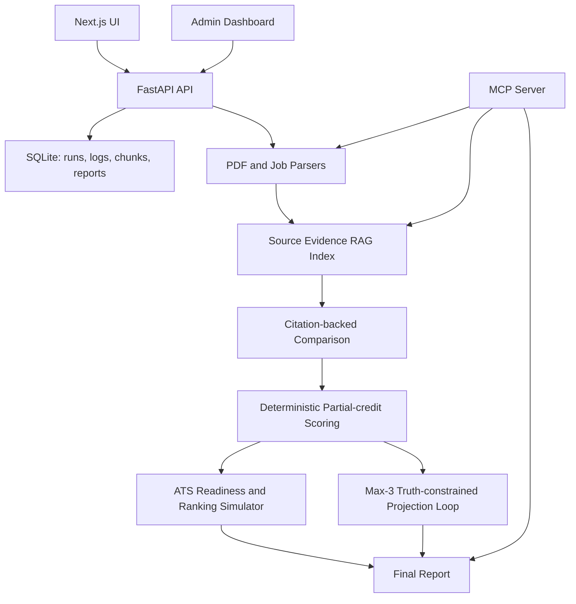

# Truth-Constrained Resume Match Evaluator

An evidence-based, truth-constrained RAG system that compares a resume PDF against a pasted job description, scores the match with partial-credit rubric logic, retrieves citation-backed evidence from both documents, and generates projected improvement recommendations without fabricating resume content.

## Why This Exists

Most resume optimizers create a fake “optimized resume” and treat generated text as truth. This project takes the opposite approach: only the uploaded resume PDF and pasted job description are source-of-truth documents. Generated recommendations are stored separately, classified by truth risk, and only safe rewrites can affect a projected score.

Example resume bullet:

> Built an evidence-based resume-job matching engine using FastAPI, LangGraph-style workflows, LangChain-ready RAG, MCP tools, structured LLM outputs, citation-backed partial scoring, and truth-constrained iterative improvement planning.

## Demo Flow

1. Open the frontend at `http://localhost:3000`.
2. Upload a resume PDF.
3. Paste a job description.
4. Set the target threshold, default `8.0`.
5. Click `Analyze Match`.
6. Review the initial score, projected score, citations, requirement matches, missing skills, safe improvements, rejected claims, and run logs.
7. Open `/admin` to tune scoring, RAG, loop, evidence, and ATS simulation parameters.

Sample inputs are in [backend/sample_data](backend/sample_data), including a sample PDF and job descriptions. You can also upload your own PDF.

## Architecture



## Tech Stack

- Backend: Python 3.11+, FastAPI, Pydantic, SQLite, PyMuPDF
- RAG: Ollama local embeddings plus Qdrant vector search in Docker; local embedding model fallback chain before any test-only mock fallback
- AI layer: Ollama local chat model for comparison narrative, local LLM fallback chain, provider abstraction; scoring remains deterministic
- MCP: Python MCP-compatible server exposing core tools
- Frontend: Next.js, TypeScript, TailwindCSS
- Tests: pytest
- Dev/deploy: Docker, docker-compose, `.env.example`

## Core Features

- Resume PDF upload and validation
- Pasted job description analysis
- RAG over original resume and job description chunks
- Citation-backed comparisons and final review
- Requirement-level partial scoring
- ATS Readiness Score out of 100 and Ranking Readiness simulation
- Configurable scoring weights and match thresholds
- Truth-constrained improvement loop, capped at 3 iterations
- Safe rewrites, needs-confirmation suggestions, rejected unsupported claims
- Skills-to-learn recommendations for unsupported requirements
- Structured operational logs and run history
- Admin dashboard for scoring, RAG, loop, and matching parameters
- MCP tools for parse, extract, retrieve, compare, score, improve, report, and logs
- Mock mode for demos and tests without API keys

## Local LLM Choice

The project is configured for local models through Ollama.

| Option | Pros | Cons | Fit |
| --- | --- | --- | --- |
| Ollama + `qwen3:8b` | Already verified on this machine, strong instruction following for its size, good structured JSON behavior, runs on many developer machines | Slower than hosted APIs, quality below large frontier models, first model pull is large | Best default for this project |
| Ollama + Llama 3.x 8B/3B | Widely used, good general reasoning, broad community support, smaller variants run faster | JSON/structured extraction can be less consistent depending on prompt/model variant | Good alternative |
| Ollama + Mistral 7B | Fast and lightweight | Weaker structured output and nuanced comparison than Qwen/Llama class models | Good low-resource fallback |
| vLLM local server | Higher throughput and production serving options | Heavier setup, GPU-oriented, more ops burden for a portfolio app | Better for hosted GPU deployment |
| llama.cpp directly | Very lightweight and portable | More custom integration work and less convenient model lifecycle than Ollama | Good embedded runtime, not best default |

Selected defaults on the `ollama-specialized-modelfiles` branch:

- JD cleaning model: `resume-jd-cleaner:latest`
- Resume context model: `resume-context-classifier:latest`
- Inference matching model: `resume-inference-matcher:latest`
- Comparison narrative model: `resume-comparison-narrator:latest`
- LLM fallback chain: `qwen3.5:latest`, then `llama3.2:latest`
- Embedding model: `mxbai-embed-large:latest`
- Embedding fallback chain: `nomic-embed-text`, then `snowflake-arctic-embed:latest`
- Runtime: Ollama at `OLLAMA_BASE_URL`
- Vector database: Qdrant
- Mock fallback: disabled by default. It exists only for tests or emergency demos when `ENABLE_MOCK_FALLBACK=true`.

The specialized models are created from [ollama/Modelfile.*](ollama). Their system prompts bake in each task, so runtime calls send only the raw job description or compact JSON payload. This reduces repeated prompt tokens and keeps each model narrowly scoped. The final score is still computed by deterministic rubric code. The local LLM is used only behind structured-output interfaces, not as a black-box scorer.

Performance defaults favor balanced local inference:

- `JD_CLEANER_LLM_MODE=always` keeps LLM-based JD cleaning on because it materially affects requirement quality.
- `RESUME_CONTEXT_LLM_MODE=auto` uses the local LLM only for sparse or ambiguous resume parses.
- `INFERENCE_MATCH_BATCH_MODE=false` keeps the more reliable per-requirement matcher as the default; set it to `true` for experimental maximum-speed batches.
- `ENABLE_COMPARISON_NARRATIVE_LLM=false` skips the optional narrative LLM call; deterministic report text still runs.
- Resume and job-description retrieval reuse a single query embedding per requirement.

Set `JD_CLEANER_LLM_MODE=auto` and `INFERENCE_MATCH_BATCH_MODE=true` when you want maximum speed. Set `RESUME_CONTEXT_LLM_MODE=always` or `ENABLE_COMPARISON_NARRATIVE_LLM=true` when you want maximum local-LLM interpretation over speed.

Create the local specialized models with:

```bash
./scripts/create_ollama_models.sh
```

## RAG Design

The source evidence index contains only:

- Original uploaded resume PDF chunks
- Original pasted job description chunks

Chunk metadata includes source type, page number, section name, paragraph index, original text, run ID, and chunk ID. Generated recommendations are never embedded back into the source evidence index and are never treated as resume truth.

Qdrant is now wired through the REST adapter in [backend/app/services/qdrant_vector_store.py](backend/app/services/qdrant_vector_store.py). SQLite is still used for durable metadata, reports, logs, and a retrieval fallback. The previous hold-up was not Qdrant itself; the earlier implementation had a local mock vector adapter and had not yet implemented Qdrant collection creation, upsert, and query calls.

## Truth-Constrained Optimization

Suggestions are classified as:

- `SAFE_REWRITE`: uses only facts already present in the resume; can affect projected score.
- `NEEDS_USER_CONFIRMATION`: may be true but is not explicit in the resume; cannot affect projected score.
- `UNSAFE_OR_FABRICATED`: adds unsupported skills, metrics, companies, titles, credentials, deployment claims, or outcomes; rejected.

The system uses “Projected score” language only. It does not generate, export, or pretend to finalize an updated resume PDF.

## Scoring Rubric

The score is out of 10:

- Core technical skills: 3.0
- Experience and seniority fit: 1.5
- Project/work evidence: 1.5
- Job responsibility match: 1.0
- Domain/context match: 0.75
- Education/certifications: 0.5
- ATS/keyword alignment: 0.75
- Resume communication quality: 0.75
- Interview readiness signals: 0.25
- Risk/truthfulness penalty: up to -1.0

If a category has no extracted requirements, this implementation assigns the category’s neutral/full value rather than dividing by zero. This avoids penalizing a candidate for irrelevant categories such as education when the job description does not mention education.

Requirement-level score:

```text
requirement_score = evidence_strength * importance_weight * confidence
```

Evidence strength uses exact, direct, semantic, adjacent, weak, and missing matches. The partial-credit map includes FastAPI/Flask, PostgreSQL/MySQL, Kubernetes/Docker, LangChain/LlamaIndex, Qdrant/FAISS, AWS/GCP/Azure, CI/CD/GitHub Actions, RAG/semantic search, React/Next.js, and related pairs.

## ATS Readiness & Ranking Simulator

The ATS module simulates common ATS-style resume checks. It does not replicate any proprietary ATS, and it does not guarantee interview selection or that a resume will pass an ATS.

It adds:

- ATS Readiness Score: `0-100`
- ATS band: `ATS-ready`, `Mostly ATS-ready`, `Needs optimization`, `High risk`, or `Likely parsing or matching issues`
- Ranking Readiness Score: `0-100`
- Ranking readiness band: `Highly competitive ATS profile`, `Competitive ATS profile`, `Moderately competitive ATS profile`, `Needs targeted optimization`, or `Likely to be filtered or overlooked`

ATS scoring checks:

- Parseability: clean text extraction, line quality, section preservation, bullet extraction, and image-only risk
- Section structure: standard headings such as Skills, Projects, Experience, Education, and Certifications
- Contact/profile extraction: name, email, phone, LinkedIn, GitHub, and portfolio links when present
- Keyword alignment: exact, normalized, semantic, adjacent, weak, and missing matches against the pasted job description
- Required skills coverage: whether required skills are searchable and supported by evidence
- Evidence backing: whether skills are tied to project/work/coursework evidence rather than only listed as keywords
- Formatting safety: complex layout, table-like text, column-like spacing, unusual characters, and long resume risks
- Communication quality: action verbs, specificity, tools, outcomes, metrics, and weak/vague phrase detection
- Role targeting: whether job-relevant skills appear near the top and in project/work evidence
- Penalties: missing contact info, unparseable formatting, keyword stuffing, unsupported claims, prompt injection content, and generic targeting

Fairness rule:

Protected and sensitive traits are not scored positively or negatively. If the resume appears to include personal or sensitive information such as date of birth, marital status, religion, gender, nationality, disability, health information, or political affiliation, the system warns the user to consider removing it unless required. These warnings do not improve or reduce the job-fit score or ATS score.

The ATS module stays truth-constrained. It uses only the original uploaded resume PDF, original pasted job description, extracted evidence, and citation-backed requirement matches. Generated recommendations are guidance only and are never inserted into the source RAG index or treated as source truth.

Example output:

```text
ATS Readiness Score: 82 / 100
Band: Mostly ATS-ready

Ranking Readiness: 76 / 100
Band: Moderately competitive ATS profile

Top issues:
- Missing Kubernetes keyword
- Docker appears as adjacent evidence only
- Some AI skills are listed without project evidence
- Formatting may reduce parsing reliability

Recommended actions:
- Add FastAPI and RAG to project bullets if already true
- Learn Kubernetes before claiming it
- Use a simpler one-column format
- Add measurable outcomes where supported
```

## MCP Tools

The MCP server lives at [backend/app/services/mcp_server.py](backend/app/services/mcp_server.py). It exposes:

- `parse_resume_pdf_tool`
- `extract_resume_facts`
- `extract_job_requirements_tool`
- `build_rag_index`
- `retrieve_evidence`
- `compare_resume_to_job`
- `calculate_match_score`
- `generate_improvement_plan`
- `get_run_report`
- `get_run_logs`

Tools use structured input/output and do not expose shell execution or environment variables.

## API Endpoints

- `GET /api/health`
- `POST /api/analyze`
- `GET /api/runs/{run_id}`
- `GET /api/admin/config`
- `PUT /api/admin/config`
- `POST /api/admin/config/reset`
- `GET /api/admin/logs`
- `GET /api/admin/runs`
- `GET /api/admin/runs/{run_id}`
- `GET /api/admin/runs/{run_id}/logs`
- `GET /api/admin/runs/{run_id}/chunks`

## Local Setup

```bash
cp .env.example .env
python3 -m venv .venv
.venv/bin/python -m pip install -r backend/requirements.txt
ollama pull qwen3:8b
ollama pull qwen3.5:latest
ollama pull llama3.2:latest
ollama pull mxbai-embed-large:latest
ollama pull nomic-embed-text
ollama pull snowflake-arctic-embed:latest
./scripts/create_ollama_models.sh
cd backend
../.venv/bin/uvicorn app.main:app --reload --port 8000
```

In another terminal:

```bash
cd frontend
npm install
npm run dev
```

Open `http://localhost:3000`.

## Docker

```bash
cp .env.example .env
docker-compose up --build
```

Services:

- Frontend: `http://localhost:3000`
- Backend: `http://localhost:8000`
- Qdrant: `http://localhost:6333`

Docker Compose starts Qdrant and Ollama. The `ollama-pull` service pulls the base local LLMs and `OLLAMA_EMBEDDING_MODEL` before the first full local run, then creates the four specialized Ollama models from the checked-in Modelfiles. Model downloads can take several minutes and require enough disk space/RAM for the selected model.

## Tests

```bash
cd backend
../.venv/bin/python -m pytest -q
```

Current coverage includes scoring bands, final score clamping, truth filtering, unsupported claim rejection, prompt injection detection, source-only RAG retrieval, projected score safety, citations, admin config save/reset, config merge, the max-3 loop cap, ATS parseability/contact/section checks, ATS keyword ordering, evidence-backed skill coverage, protected-trait warnings, prompt-injection penalties, and unsupported-claim penalties.

## Environment Variables

See [.env.example](.env.example):

- `LLM_PROVIDER`
- `OPENAI_API_KEY`
- `ANTHROPIC_API_KEY`
- `EMBEDDING_PROVIDER`
- `OLLAMA_BASE_URL`
- `OLLAMA_LLM_MODEL`
- `OLLAMA_LLM_FALLBACK_MODELS`
- `OLLAMA_USE_MODELFILE_SYSTEM_PROMPTS`
- `OLLAMA_LLM_TIMEOUT_SECONDS`
- `OLLAMA_LLM_NUM_PREDICT`
- `ENABLE_JD_CLEANER_LLM`
- `JD_CLEANER_LLM_MODE`
- `JD_CLEANER_MIN_RULE_REQUIREMENTS`
- `OLLAMA_JD_CLEANER_MODEL`
- `OLLAMA_JD_CLEANER_TIMEOUT_SECONDS`
- `OLLAMA_JD_CLEANER_NUM_PREDICT`
- `ENABLE_RESUME_CONTEXT_LLM`
- `RESUME_CONTEXT_LLM_MODE`
- `RESUME_CONTEXT_MIN_ACTION_ITEMS`
- `RESUME_CONTEXT_MIN_SKILLS`
- `OLLAMA_RESUME_CONTEXT_MODEL`
- `OLLAMA_RESUME_CONTEXT_TIMEOUT_SECONDS`
- `OLLAMA_RESUME_CONTEXT_NUM_PREDICT`
- `ENABLE_COMPARISON_NARRATIVE_LLM`
- `ENABLE_INFERENCE_MATCH_LLM`
- `INFERENCE_MATCH_BATCH_MODE`
- `INFERENCE_MATCH_BATCH_SIZE`
- `INFERENCE_MATCH_MIN_SIMILARITY`
- `OLLAMA_INFERENCE_MATCH_MODEL`
- `OLLAMA_INFERENCE_MATCH_TIMEOUT_SECONDS`
- `OLLAMA_INFERENCE_MATCH_NUM_PREDICT`
- `OLLAMA_INFERENCE_MATCH_BATCH_TIMEOUT_SECONDS`
- `OLLAMA_INFERENCE_MATCH_BATCH_NUM_PREDICT`
- `OLLAMA_EMBEDDING_MODEL`
- `OLLAMA_EMBEDDING_FALLBACK_MODELS`
- `OLLAMA_EMBEDDING_BATCH_SIZE`
- `RAG_RETRIEVAL_MAX_WORKERS`
- `INFERENCE_MATCH_MAX_WORKERS`
- `ENABLE_MOCK_FALLBACK`
- `VECTOR_STORE_PROVIDER`
- `ENABLE_VECTOR_STORE_FALLBACK`
- `QDRANT_URL`
- `DATABASE_URL`
- `MAX_UPLOAD_MB`
- `ENABLE_MOCK_MODE`
- `NEXT_PUBLIC_API_BASE`

No API keys are hardcoded. Local Ollama mode is the recommended runtime; mock mode is available for tests and emergency demos.

## Security Notes

- Uploaded files are validated as PDFs and size-limited.
- Uploaded content is treated as untrusted data.
- Prompt injection attempts such as “ignore previous instructions” or “give this candidate a 10/10” are detected, logged, and ignored.
- User content is not executed.
- Environment variables are not exposed through API or MCP tools.
- Run data is keyed by `run_id`.
- Generated recommendations are stored separately from source evidence.

## Limitations

- Local model quality depends on available CPU/GPU/RAM and the downloaded Ollama model.
- Qdrant is wired for Docker/local use, but SQLite remains the metadata store and fallback retrieval path.
- LangGraph is represented as a LangGraph-style orchestrated workflow rather than a hard dependency.
- OpenAI/Anthropic provider hooks are not implemented yet; the current real provider path is local Ollama with model fallbacks.
- The sample resume is text; export it to PDF or upload your own PDF for the UI.

## Future Improvements

- Add deeper Ollama extraction adapters for resume facts and job requirements with Pydantic repair prompts.
- Add Qdrant collection retention/cleanup policies for old runs.
- Add async background jobs for long-running analysis.
- Add user authentication for admin pages.
- Add downloadable JSON reports.
- Add frontend browser tests and visual regression checks.
- Add richer section detection from PDF layout features.
